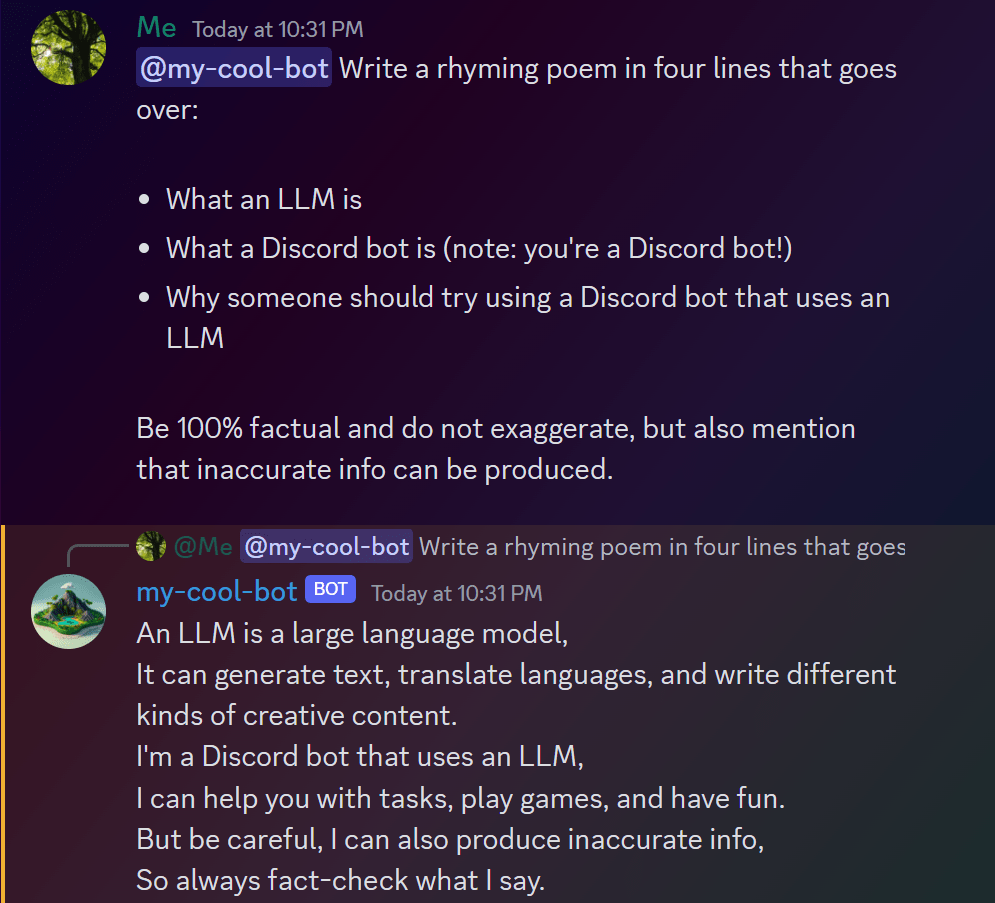
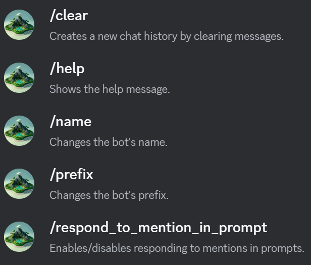

# 🌴 discord-palm-bot

A [Discord](https://discord.com) bot that integrates with [LangChain](https://www.langchain.com/) to use the [PaLM 2 model](https://ai.google/discover/palm2/) through MakerSuite to provide an ongoing chat. It utilizes artificial intelligence to generate responses and engage in conversations.

## Table of Contents

-   [🎬 Demo](#🎬-demo)
-   [✨ Features](#✨-features)
-   [📖 Commands](#📖-commands)
-   [📚 Tech Stack](#📚-tech-stack)
-   [🛠 How to Setup](#🛠-how-to-setup)
-   [🌊 Docker Setup](#🌊-docker-setup)
-   [🤝 Contributing](#🤝-contributing)
-   [📝 License](#📝-license)
-   [Disclaimer](#disclaimer)

## 🎬 Demo



## ✨ Features

-   **Conversations with AI**: Engage with Google's PaLM API using a Discord bot that allows you to mock ongoing conversations with the Chat Bison model.
-   **Slash Commands**: Try a range of slash commands for interacting with the bot. Use `/help` to view all available commands.
-   **Context Persistence**: Recent conversation history is maintained by saving it to a local `messages.jsonl` file. Even after restarting the bot, it can continue conversations by using the `messages.jsonl` as its input. Use `/clear` command to clear the file and chat history.
-   **Customizable Prefix**: Communicate with the bot using a custom prefix (default is `$`). You may change this prefix using the `/prefix` command. You can even use the bot's mention as a prefix (e.g. `/prefix @my-bots-name`).
-   **Mention-based Interaction**: By default, a mention of the bot anywhere in your message triggers a response. You can toggle this feature using the `/respond_to_mention_in_prompt` command by setting it to `True` or `False`, and also via your settings in `config.json`.
-   **Long Output Handling**: The bot can handle long output by letting you choose between sending individual messages where the bot is responding or sending them in a thread by selecting a button.
-   **Configuration Management**: A dedicated [config.json](config.json) file can help manage settings like the bot's prefix and its response behavior to mentions.

## 📖 Commands



For more details use the `/help` command with the Discord bot.

## 📚 Tech Stack

-   [Python](https://www.python.org/) - Programming language
-   [discord.py](https://discordpy.readthedocs.io/en/stable/) - Python library for Discord API
-   [LangChain](https://www.langchain.com/) - LLM abstraction library
-   [black](https://github.com/psf/black) - Python code formatter (using [the Visual Studio Code extension](https://marketplace.visualstudio.com/items?itemName=ms-python.black-formatter))

Other packages may be found in [`requirements.txt`](requirements.txt).

> **Note**: Sending multiple messages to the bot at the same time should still provide responses, but the chat history context may not be saved in the proper order. This may be an issue to resolve in the future. It is recommended to send one message at a time and wait for a response before sending another message.

## 🛠 How to Setup

1. Access the PaLM API which you can get by [joining the developer preview waitlist](https://developers.generativeai.google/) and receiving access through MakerSuite.

2. [Set up a Discord bot account and a Discord bot](https://discordpy.readthedocs.io/en/stable/discord.html) with the following settings:

-   Scopes
    -   applications.commands
    -   bot
-   Permissions
    -   Send Messages
    -   Read Messages/View Channels
-   Intents
    -   Message Content Intent

Though some of these settings may not be necessary, I've found that these are the ones that work for me.

Your resulting invite link should look similar to this:

```
https://discord.com/api/oauth2/authorize?client_id=<bot-client-id>&permissions=3072&scope=bot%20applications.commands
```

3. Add your PaLM API key and Discord bot token to a `.env` file, which you can simply do by replacing the values in the [`.env.example`](.env.example) file and renaming the file to `.env`.

> Remember to keep your API keys secret!

> For Docker instructions skip to the [🌊 Docker Setup](#🌊-docker-setup) section.

4. Install [Python](https://www.python.org/downloads/) on your system.

5. Install the necessary packages (preferably in [a virtual environment](https://realpython.com/python-virtual-environments-a-primer/)) with `pip install -r requirements.txt` and then run the bot with `python bot.py`.

The message history should be saved in a `messages.jsonl` file in the same directory as the bot, which is used when restarting the bot. You can clear this file and also the current message history with the `/clear` command.

> Note: Since there is a limit to how much data can be sent to the PaLM API at once, when the message history is large then the most recent messages within the limit are used.

## 🌊 Docker Setup

1. Complete steps 1-3 in the [🛠 How to Setup](#🛠-how-to-setup) section.

2. Install [Docker](https://www.docker.com/) on your system and start the Docker engine.

3. Build the Docker image with:

```bash
docker build -t discord-llm-bot .
```

4. Run the Docker image with:

```bash
docker run -d --env-file .env discord-llm-bot
```

Your bot should now be running in a Docker container!

Here are some useful commands:

| Command                      | Description                               |
| ---------------------------- | ----------------------------------------- |
| `docker ps`                  | View the container ID.                    |
| `docker logs <container-id>` | View the logs.                            |
| `docker stop <container-id>` | Stop the container.                       |
| `docker rm <container-id>`   | Remove the container.                     |
| `docker rmi discord-llm-bot` | Remove the image named `discord-llm-bot`. |

## 🤝 Contributing

Contributions are welcome! If you have any ideas, fixes, or suggestions, please open an [issue](https://github.com/rzmk/discord-palm-bot/issues) or submit a [pull request](https://github.com/rzmk/discord-palm-bot/pulls).

Some documentation that may be useful include:

-   [discord.py docs](https://discordpy.readthedocs.io/en/stable/)

## 📝 License

This project is licensed under the [MIT License](LICENSE).

## Disclaimer

This bot and project are not affiliated with Discord, Google, LangChain, and MakerSuite.

By using this bot and/or project you acknowledge the following:

-   The bot and AI output may generate content that may be inaccurate and does not reflect the views of the bot owner.
-   The bot may generate inaccurate responses that seem factual but are not, and other false/inaccurate information.

Please use responsibly.
